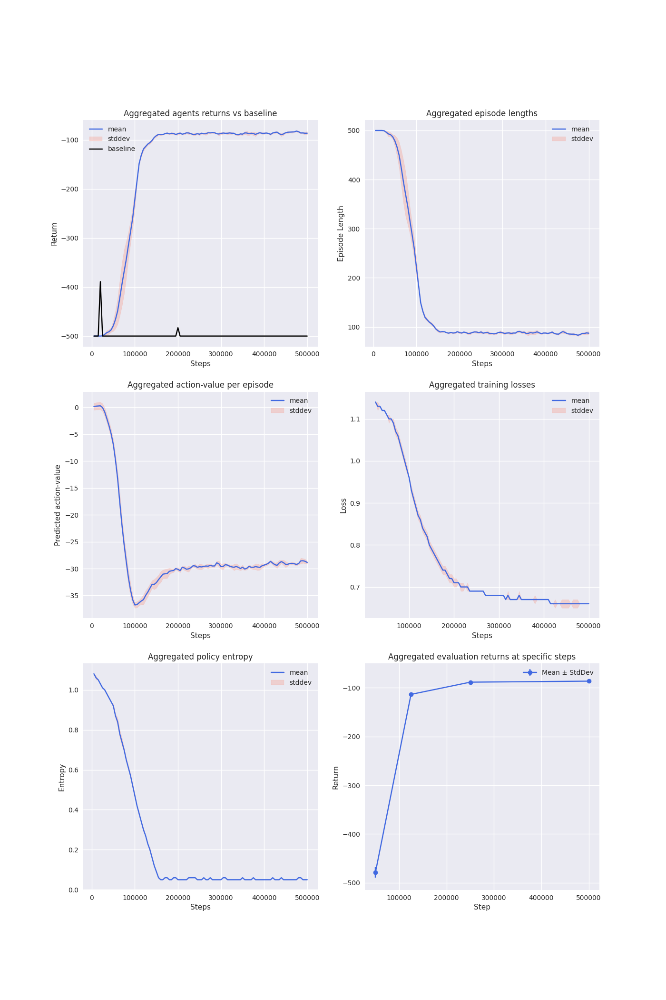
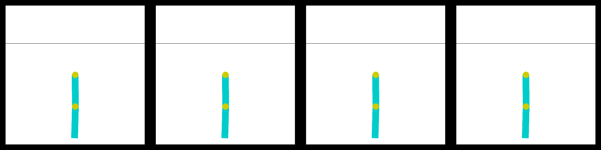
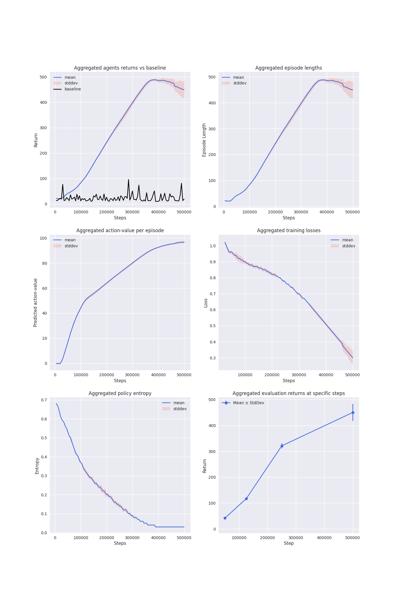
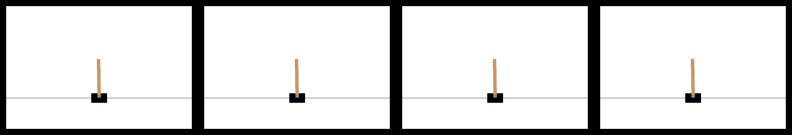
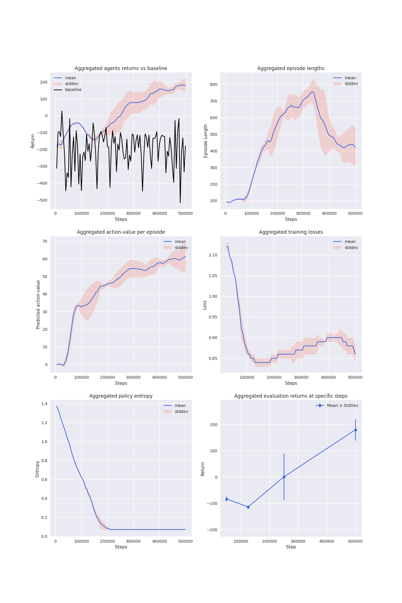
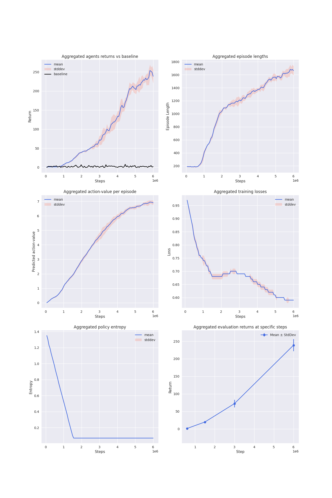
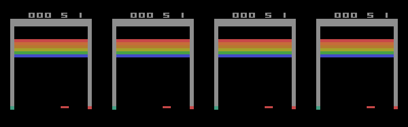
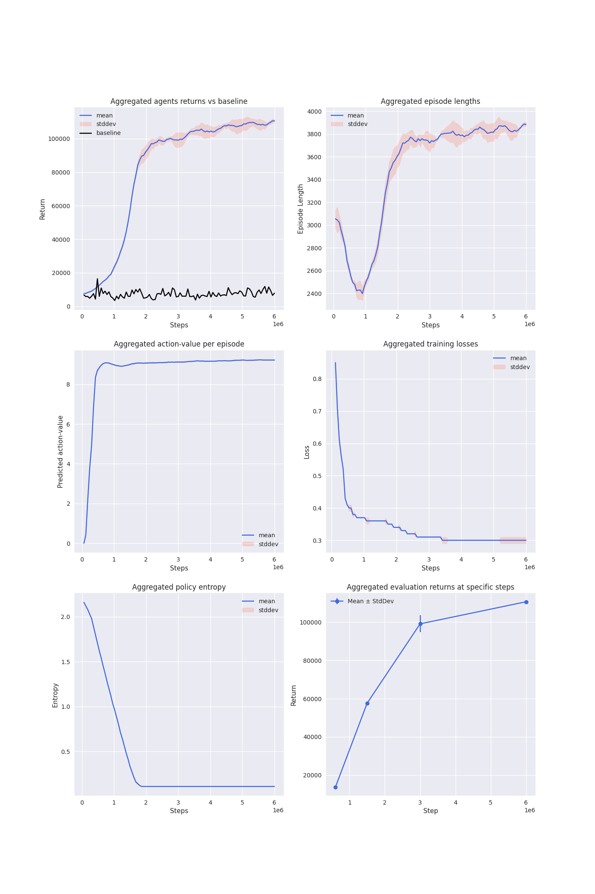
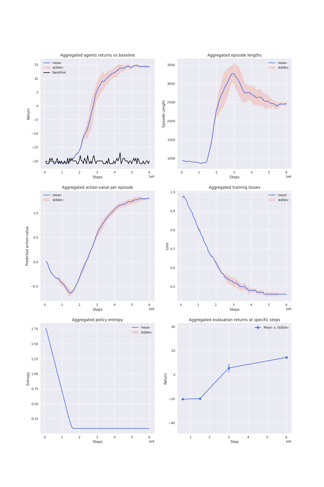
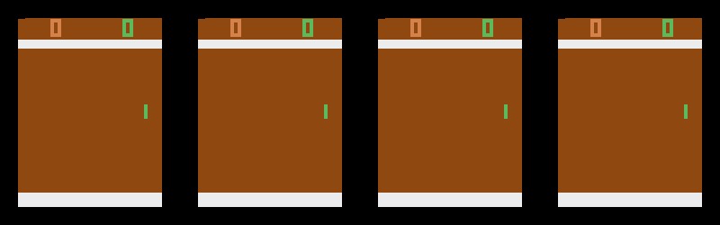

# categorical
Pytorch implementation of the Categorical-DQN (C51) reinforcement learning agent along with experiments.

# Intro
This project implements a deep reinforcement learning agent from scratch, as well
as training agents on various environments ranging from easy to learn environments such as Cart Pole to more difficult
ones such as the atari environments. Pytorch is used for the
deep learning part. Moreover, the same implementation is used to train agents on all of these environments without the
need to do multiple implementations due to the difference in observations and all other code differences that comes
with it. All is needed is to provide the name of an environment and choosing hyperparameters, then training can be
started.

The agent implemented is the Categorical-DQN agent (C51-agent)
(`Bellemare et al. (2017) https://arxiv.org/abs/1707.06887), which is a distributional
version of the DQN agent where instead of action-values, the network outputs the entire return distribution for each
action, and actions are chosen based on expected returns.

The essential components of the implementation are as follows: an *Environment* that we want to solve, an *Agent* which
interacts with the environment during a number of steps to learn its dynamics, a *Function* that enables the agent to
interact with the environment, and additionally functions to visualize the training progress and what the agent has
learned.
The code is separated into multiple files, agent, network, memory and training functions all are independent. 
Apart from these, there are files for producing videos and images, along with other utility functionality.

# Environments
An env can be created and applied with the necessary wrappers, such `AtariPreprocessing` for atari environments. The
`FrameStack` wrapper is used for all environments, even though it is not necessary for environments like Cart Pole,
however, in these cases only one observation is used. For some atari environments, an agent can receive a
termination signal once a life is lost, however this is not recommended
(`Machado et al. (2018) https://arxiv.org/abs/1709.06009`), therefore here
termination signal is issued only when a game is over.
The implementation is focused on control environments and atari environments where the actions
are discrete and observations are arrays.

# Agent, network and memory
An agent in this case is an entity that has a
*memory* to store experiences and remember them for learning, a *network* that perceives observations and provides
predictions, an *optimizer* which is used for updating the network parameters, that's updating the prediction
ability. An agent should also be able to ``act`` on observations, as well as have the ability to ``learn`` and
improve itself.

# Training and evaluation
In order to train an agent on a specific environment, we need a function to implement the interaction between the
two. The ``train.train`` function does that, where it creates buffers for storing intermediate results, and runs the 
training process. It also stores
the results into a ``MetricsLogger`` object periodically, and once training has finished this logger is returned.
The agent is evaluated periodically, and a method that
`Machado et al. (2018) https://arxiv.org/abs/1709.06009` is proposing to become a standard, an agent should
be evaluated at different stages during the training where the evaluation is simply the average episodic returns of
the past ``k`` episodes. In this case an agent is evaluated at 10%, 25%, 50% resp. 100% of the training steps, each
time taking the average of the past 100 episodes returns.
Additionally, a gif can be recorded for the lst episode at the evaluation points.

# Visualization
This article `https://neptune.ai/blog/reinforcement-learning-agents-training-debug` lists a number of metrics to
log for a good insight into the agent's learning. A number of them are implemented here. At the end of
training, a plot is made with the following average episodic metrics:

reward and length: to determine how well the agent does on each episode and how long it plays and whether it
learns to live longer (ex. Cart Pole) or reach the goal state quickly (ex. Lunar Lander),

predicted action-value of the selected actions: this can be compared to the actual episode rewards, and they should
be similar because that is what the agent predicts to determine how an episode ends, and behaves based on it,

loss: in this case the cross-entropy term of the KL divergence,

policy entropy: which can be used to determine if the exploration phase is enough. If entropy is always high,
then the agent is unsure about the value of a state, and if it drops rapidly, then it is falsely
very sure about the value of a state. Ideally, as the agent explores, entropy should be high
because of the randomness of action-selection, but as the agent exploits more, entropy should
decrease indicating determinism of predicted state value,

evaluation: lastly, the agent evaluation points is plotted. Note that the evaluation values are identical to
those of the training rewards, due to the fact the past *k* (``usually k=100``) episode rewards are
averaged for both metrics.

Also, since agents are trained with different seeds, the average and standard deviation is what is plotted.

# Results
Four agents are trained on six different environments, and the results are shown below.
The blue line depicts the mean of the four agents results, while the red shaded area is the stddev.
The evaluation plot consists of a straight line depicting the mean, and the bars stand for the stddev.
The gifs consist of four parts, each made at each evaluation point lasting for two episodes.
Gifs are made for the first seed only.
Also, the agent return is compared to a random baseline.

#### 1. Acrobot-v1

These results suggest that the learning is robust across seeds, and the task is solved efficiently.

#### 2. Cartpole-v1

Although the task is solved, the performance degrades somewhat for some seeds. The CartPole-v1 is considered
solved when an agent scores at least 485 on average for 500 consecutive episodes.

#### 3. LunarLander-v2

The task is solved here too, despite quite some variance in performance between the seeds.
Interestingly, the length metric first increases while agents are learning, but then it reverses,
as agents want to reach the goal state quickly.

#### 4. BreakoutNoFrameskip-v4

For Breakout, judging from the plots, it seems like more training would have been beneficial.
However, comparing it to the reported results for DQN in
`Machado et al. (2018) https://arxiv.org/abs/1709.06009`, these results
are acceptable.

#### 5. CrazyClimberNoFrameskip-v4

The Crazy Climber environment seems to have been solved rather good, although better than this
is reported in `Bellemare et al. (2017) https://arxiv.org/abs/1707.06887`.

#### 6. PongNoFrameskip-v4

And lastly, training for Pong also looks alright, despite not being solved fully.
Here too, the length metric reverses, as agents need to beat the opponent fast.

# Author
- Hardy Hasan